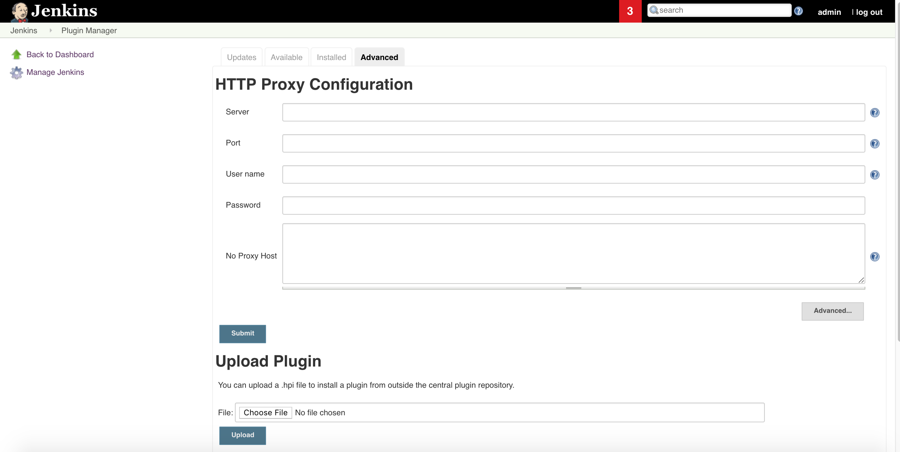

===================
Download the JTE Plugin
===================

Download the code repository for the Jenkins Templating Engine by running: 

.. code::

    git clone https://github.com/boozallen/jenkins-templating-engine.git

This will create a new directory called ``jenkins-templating-engine``, which has all the things you will need to build the plugin. Navigate into the jenkins-templating-engine directory:

.. code::

    cd jenkins-templating-engine

As this plugin was created using Gradle, you will be able to build the plugin yourself. Just run the following command:

.. code::

    gradle clean jpi

After a successful build, there should now be a directory called ``build`` within the ``jenkins-templating-engine`` directory and a libs directory within the ``build`` directory. Within the libs directory, you should see a file called ``jte.hpi``, which is the plugin that we will be installing in Jenkins in your Jenkins instance.

==================================
Installing the Plugin Into Jenkins
==================================

As the Jenkins Templating Engine was built to be a Jenkins Plugin, you will now be uploading into Jenkins the plugin that you built in the step before. In your browser, navigate to the plugin manager for your jenkins instance at http://localhost:8080/pluginManager/advanced where http://localhost:8080 is replaced with the URL for your Jenkins instance.

The following image should be shown:

  
In the section labeled “Upload Plugin” click the Choose File button. 

Find where the jte.hpi file was built from the end of the first step. It should be located in your project under the path  ``/jenkins-templating-engine/build/libs``.

Select the ``jte.hpi`` file and click **Open**.

Afterwards, click the **Upload** button right below where you selected Choose File, as shown in the red highlighted box.

 .. image:: ../images/upload_plugin.png
   :scale: 50%

The JTE plugin should now be installed along with all the plugins it depends on as shown in the following screen.

 .. image:: ../images/plugins_downloading.png
   :scale: 100%
  
When there’s a “Success” indicator next to the “jte” plugin, the JTE plugin should now be installed. To use it, you will have to restart your Jenkins instance. In your browser, navigate to the plugin manager for your jenkins instance at http://localhost:8080/restart where http://localhost:8080 is replaced with the URL for your Jenkins instance.

Click **Yes** when asked if you want to restart Jenkins.

When Jenkins is done restarting, enter the credentials you used to create an admin. user when you first started the Jenkins instance. You should now have the Jenkins Templating Engine installed on your Jenkins instance!
